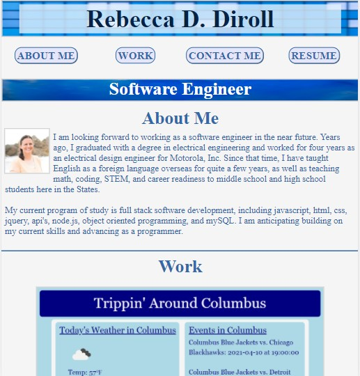
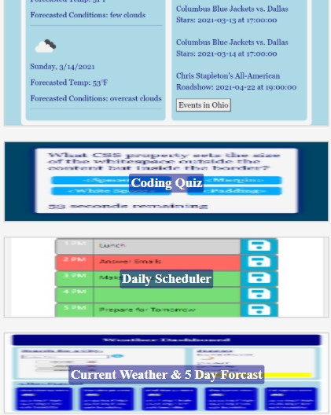

My Portfolio

This project is an online, web-based portfolio that showcases the work that I have have done and the html, css, and javascript skills that I have built.

Deployed Web Page: https://rebecca-diroll.github.io/08-Portfolio/

GitHub Repository: https://github.com/Rebecca-Diroll/08-Portfolio

The portfolio contains the following elements:
1. Name
2. Navigation Links
3. Job Title
4. About Me section with photo and text
5. Work section showcasing a group project, coding quiz, daily scheduler, and weather app.
6. Contact section with phone nubmer, email, GitHub, and LinkedIn links
7. Resume section
8. Footer section with nav links to the main sectons of the profile
9. Media queries and responsive design
10. Debug GitHub issues

Technologies used: html, css, mobile first design, and media queries.

